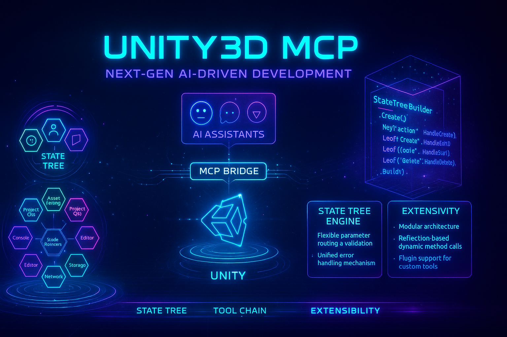
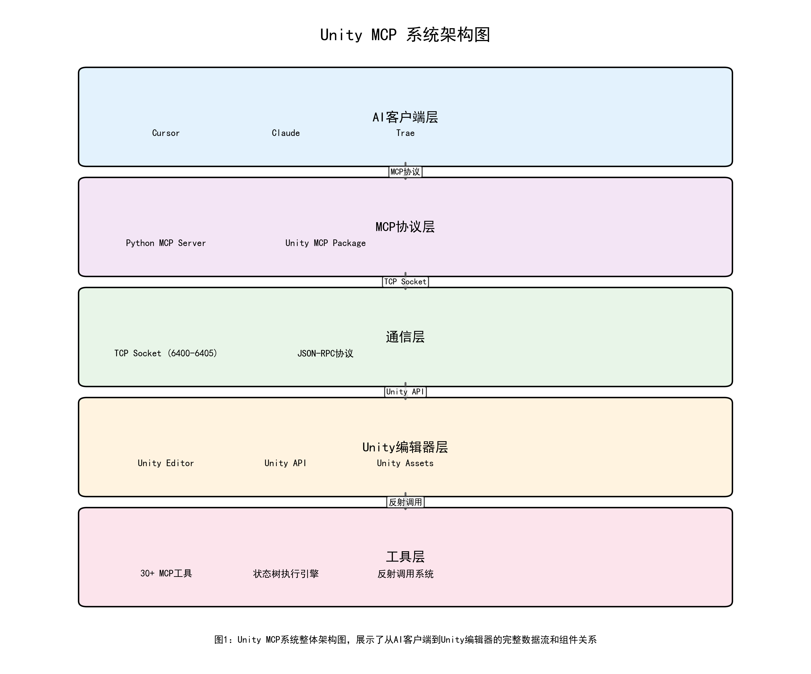
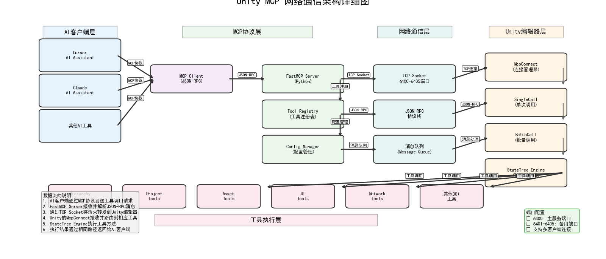

**English** | [中文](README.zh-CN.md)

---

# Unity3d MCP Documentation



## Table of Contents
1. [System Overview](#system-overview)
2. [Architecture](#architecture)
3. [Source Code](#source-code)
4. [Usage](#usage)
5. [Agent Skills Module](#agent-skills-module)
6. [Innovation](#innovation)
7. [Technical Features](#technical-features)
8. [API Reference](#api-reference)
9. [Troubleshooting](#troubleshooting)

---

## System Overview

*Unity3d MCP — Bridging AI and Unity for intelligent game development*

Unity3d MCP (Model Context Protocol) is an AI–Unity integration system that connects AI assistants (e.g. Cursor, Claude, Trae) with the Unity Editor via a built-in MCP server, enabling an AI-driven Unity workflow.

### Core Value
- **AI-driven development**: Control the Unity Editor with natural language
- **Seamless integration**: Works with mainstream AI clients without changing your workflow
- **Rich tooling**: 40+ tools covering the full Unity development pipeline
- **High performance**: HTTP-based communication
- **Extensible**: Modular design for easy extension
- **Zero config**: Built-in MCP server inside Unity, no external dependencies

### System Components
- **Built-in MCP Server** (C#): MCP protocol server inside the Unity Editor
- **Unity Package** (C#): Full Unity Editor plugin
- **Tool ecosystem**: 40+ Unity development tools
- **Protocol**: HTTP + JSON-RPC 2.0

---

## Architecture

### Overall Architecture

Layers (top to bottom):

1. **AI client layer**: Cursor, Claude, Trae, etc.
2. **MCP protocol layer**: Unity built-in MCP server
3. **Communication layer**: HTTP (configurable port, default 8000) + JSON-RPC 2.0
4. **Unity Editor layer**: Unity Editor + Unity API
5. **Tool layer**: 40+ tools + message-queue execution engine

#### Architecture Diagram



*Figure 1: Data flow from AI clients to the Unity Editor*

#### Data Flow



*Figure 2: Flow from AI instructions to Unity execution*

### Design Principles

#### 1. Two-tier call architecture
```
AI client → FacadeTools → MethodTools → Unity API
```

- **FacadeTools**: `async_call` and `batch_call`
- **MethodTools**: 40+ methods, invoked only via FacadeTools

#### 2. State-tree execution engine
- State-based routing
- Parameter validation and type conversion
- Unified error handling

#### 3. Connection management
- Configurable port (default 8000)
- Message queue processing
- Main-thread–safe execution

---

## Source Code

### 1. Unity MCP server (C#)

#### Main files
```
unity-package/Editor/Connect/
├── McpService.cs
├── McpServiceStatusWindow.cs
└── McpServiceGUI.cs
```

#### Components
- **McpService.cs**: HTTP listener, MCP request handling
- **Message queue**: EnqueueTask / ProcessMessageQueue, main-thread execution
- **Tool discovery**: DiscoverTools, reflection-based registration of async_call / batch_call

### 2. Unity tool package (C#)

#### Structure
- **Runtime**: StateTreeContext
- **Editor/Executer**: AsyncCall, BatchCall, ToolsCall, CoroutineRunner, McpTool, StateMethodBase, IToolMethod, etc.
- **Editor/StateTree**: StateTree, StateTreeBuilder
- **Editor/Selector**: HierarchySelector, ProjectSelector, IObjectSelector
- **Editor/Tools**: Hierarchy, ResEdit, Console, RunCode, UI, Storage, etc.
- **Editor/GUI**: McpServiceGUI, McpDebugWindow

### 3. Tool categories

1. **Hierarchy**: hierarchy_create, hierarchy_search, hierarchy_apply  
2. **ResEdit**: edit_gameobject, edit_component, edit_material, edit_texture, …  
3. **Project**: project_search, project_operate  
4. **UI**: ugui_layout, ui_rule_manage, figma_manage  
5. **Console**: console_read, console_write  
6. **RunCode**: code_runner, python_runner  
7. **Editor**: base_editor, manage_package, gameplay, object_delete  
8. **Storage**: prefers, source_location  
9. **Network**: request_http  

---

## Usage

### 1. Requirements

- Unity 2020.3+ (recommended 2022.3.61f1c1)
- MCP-capable AI client (Cursor / Claude / Trae)
- Windows / macOS / Linux

No extra Python or external dependencies for the Unity package.

### 2. Configuration

#### MCP client config
Add to your AI client MCP config (e.g. `~/.cursor/mcp.json`, Claude/VS/Trae equivalents):

```json
{
  "mcpServers": {
    "unity3d-mcp": {
      "url": "http://localhost:8000"
    }
  }
}
```

#### Unity Editor

- **MCP Settings** (`Edit → Project Settings → MCP`): connection toggle, tool list, port (default 8000), log level, UI/Figma settings.
- **MCP Debug Window** (`Window → MCP → Debug Window`): call history, re-run, filter, export logs.

### 3. Agent skills and token saving

To avoid large context from full MCP tool lists and schemas, the project provides an **Agent Skills** module (see [Agent Skills Module](#agent-skills-module)). Reference `demo/.cursor/skills` SKILL.md files in Cursor Rules or Agent config so the agent loads only the needed skill docs and then calls MCP, reducing token usage.

### 4. Quick start

1. Import the Unity package and open the project.
2. The built-in MCP server starts automatically (default port 8000).
3. In the AI client, try: *"Create a Cube named Player"*.

### 5. Examples

- Create GameObject: *"Create a Cube named Player"*
- Batch: *"Create 5 Enemy objects at (0,0,0), (1,0,0), …"*
- Resources: *"Download a random image and apply it to an Image component"*

### 6. Advanced

- **Custom tools**: Add classes under `unity-package/Editor/Tools/`, inherit `StateMethodBase` or `IToolMethod`, use `ToolNameAttribute`; Unity discovers and registers them.
- **Batch**: Use `batch_call` with an array of `{ "func", "args" }` for better performance.

### 7. Extended scenarios

The doc in [README.zh-CN.md](README.zh-CN.md) describes extended scenarios (AI texture generation, Poly Haven batch download, project architecture diagrams, performance analysis, test data generation, localization). Use `python_runner` and `code_runner` for automation.

---

## Agent Skills Module

The MCP protocol exposes full tool lists and parameter schemas to the AI, which can **consume many tokens**. The project adds a **Skill** module (`demo/.cursor/skills`) used together with MCP: load skill docs on demand instead of all tool schemas at once.

### How it works

- **Skill as document**: Each skill is a `SKILL.md` (name, description, parameters, examples).
- **1:1 with MCP**: Skills describe how to call a tool via MCP (e.g. `async_call` / `batch_call` + `func` and `args`), without re-implementing logic.
- **On-demand load**: The agent reads only the relevant SKILL file when needed, instead of loading every tool schema.

### With MCP

- **MCP** handles tool discovery and execution; **Skills** describe when and how to pass arguments.
- Reference skill paths in Cursor Rules or Agent config so the agent consults the right SKILL and then calls MCP.
- This keeps full MCP capability while **reducing tokens** by not keeping 40+ tool descriptions in context.

### Recommendation

Skills live under `demo/.cursor/skills` (e.g. `unity-async-call`, `unity-hierarchy-create`). No need to list every skill in docs; document that “load the right SKILL.md from `.cursor/skills` on demand” so the agent can use skills and MCP together with less context.

---

## Innovation

### 1. Two-tier call architecture
- FacadeTools (`async_call`, `batch_call`) + 40+ MethodTools invoked only through them.

### 2. State-tree execution engine
- State-based routing, parameter validation, unified error handling.

### 3. Message-queue execution
- Configurable port (default 8000), main-thread safety, EditorApplication.update–based queue.

### 4. Coroutine support
- Async operations (e.g. HTTP, downloads) without blocking the main thread.

### 5. Smart file/data handling
- Detect file types; for large content return metadata instead of full data to save memory and bandwidth.

---

## Technical Features

- **Communication**: HTTP, JSON-RPC 2.0, message queue, batch calls  
- **Reliability**: Configurable port, main-thread safety, error handling, timeouts  
- **Extensibility**: Modular tools, reflection, custom tools, configurable parameters  
- **DX**: Natural language, real-time feedback, logging, documentation  

---

## API Reference

### Facade tools

**async_call** — single call:
```json
{
  "func": "async_call",
  "args": {
    "func": "hierarchy_create",
    "args": { "name": "Player", "primitive_type": "Cube", "source": "primitive" }
  }
}
```

**batch_call** — batch:
```json
{
  "func": "batch_call",
  "args": [
    { "func": "hierarchy_create", "args": { "name": "Player", "primitive_type": "Cube" } },
    { "func": "edit_gameobject", "args": { "path": "Player", "position": [0, 1, 0] } }
  ]
}
```

### Core tools (examples)

- Hierarchy: hierarchy_create, hierarchy_search, hierarchy_apply  
- ResEdit: edit_gameobject, edit_component, edit_material, edit_texture  
- Project: project_search, project_operate  
- Network: request_http, figma_manage  

### Response format

Success: `{ "success": true, "message": "...", "data": { ... } }`  
Error: `{ "success": false, "message": "...", "error": "..." }`

---

## Troubleshooting

### Connection

- **Cannot connect**: Ensure Unity is running, port 8000 (or your port) is free, firewall allows it; check Unity console.
- **Disconnects**: Check network, Unity performance, and timeout settings.

### Tool execution

- **Call fails**: Check parameter format and types, ensure target objects exist, permissions.
- **Partial batch failure**: Reorder operations, check resource conflicts, try smaller batches.

### Performance

- **Slow response**: Improve network, reduce Unity load, simplify operations.
- **High memory**: Destroy unused objects, release resources, check coroutine lifecycle.

### Debugging

- Enable detailed logs (e.g. `McpLogger` in Unity).
- Use MCP Debug Window for history and re-run.
- Use network tools (e.g. Wireshark) if needed for HTTP.

---

## Summary

Unity3d MCP connects AI assistants to the Unity Editor via a built-in MCP server, using a two-tier call architecture, message-queue execution, and main-thread safety. It provides 40+ tools across the Unity development pipeline.

### Advantages
1. **AI-driven**: Natural language control of the Editor  
2. **Rich**: 40+ tools for the full pipeline  
3. **Performant**: HTTP + message queue  
4. **Extensible**: Modular, custom tools  
5. **Compatible**: Works with major AI clients  
6. **Zero config**: No external MCP process  

### Use cases
- AI-assisted game development  
- Automated resource and batch operations  
- Education and training  

### Roadmap
- More Unity tools, visual tool authoring, performance and monitoring, multi-platform support, better debugging.

---

*Document version: v2.0*  
*Last updated: September 2025*  
*Unity3d MCP Development Team*
