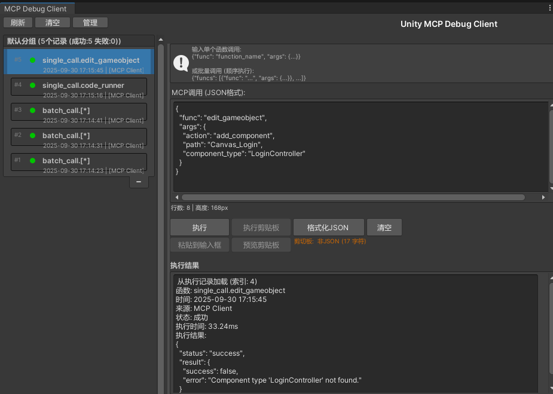

# Unity3d MCP 系统说明文档

## 目录
1. [系统概述](#系统概述)
2. [设计架构](#设计架构)
3. [源码解析](#源码解析)
4. [使用方法](#使用方法)
5. [创新点](#创新点)
6. [技术特性](#技术特性)
7. [API参考](#api参考)
8. [故障排除](#故障排除)

---

## 系统概述

Unity3d MCP (Model Context Protocol) 是一个创新的AI-Unity集成系统，它通过MCP协议将AI助手（如Cursor、Claude、Trae）与Unity编辑器无缝连接，实现AI驱动的Unity开发工作流。

### 核心价值
- **AI驱动开发**：通过自然语言指令控制Unity编辑器
- **无缝集成**：支持主流AI客户端，无需修改现有工作流
- **功能丰富**：提供30+专业工具，覆盖Unity开发全流程
- **高性能**：基于TCP Socket的高效通信机制
- **可扩展**：模块化设计，易于添加新功能

### 系统组成
- **MCP Server** (Python)：基于FastMCP的服务器端
- **Unity Package** (C#)：Unity编辑器插件
- **工具生态**：30+专业Unity开发工具
- **通信协议**：基于TCP Socket的JSON-RPC通信

---

## 设计架构

### 整体架构

系统采用分层架构设计，从上到下分为：

1. **AI客户端层**：Cursor、Claude、Trae等AI助手
2. **MCP协议层**：Python MCP Server + Unity Package
3. **通信层**：TCP Socket (6400-6405端口) + JSON-RPC
4. **Unity编辑器层**：Unity Editor + Unity API
5. **工具层**：30+专业工具 + 状态树执行引擎

#### 系统架构图


*图1：Unity3d MCP系统整体架构图，展示了从AI客户端到Unity编辑器的完整数据流和组件关系*

#### 数据流图


*图2：Unity3d MCP数据流图，详细展示了从AI指令到Unity执行的完整数据流转过程*

### 核心设计原则

#### 1. 双层调用架构
```
AI客户端 → FacadeTools → MethodTools → Unity API
```

- **FacadeTools**：`single_call` 和 `batch_call` 两个门面工具
- **MethodTools**：30+专业功能方法，仅通过FacadeTools调用

#### 2. 状态树执行引擎
- 基于状态模式的路由系统
- 支持参数验证和类型转换
- 提供统一的错误处理机制

#### 3. 智能连接管理
- 多端口自动发现 (6400-6405)
- 连接健康检查和自动重连
- 失败端口记录和智能切换

---

## 源码解析

### 1. Server端架构 (Python)

#### 核心文件结构
```
server/
├── server.py              # FastMCP服务器入口
├── config.py              # 配置管理
├── unity_connection.py    # Unity连接管理
├── tools/                 # 工具模块
│   ├── __init__.py       # 工具注册
│   ├── call_up.py        # 门面工具
│   ├── console.py        # 控制台工具
│   ├── hierarchy_*.py    # 层级管理工具
│   ├── edit_*.py         # 资源编辑工具
│   └── ...
└── requirements.txt       # 依赖管理
```

#### 关键组件解析

**1. FastMCP服务器 (server.py)**
```python
# 服务器生命周期管理
@asynccontextmanager
async def server_lifespan(server: FastMCP):
    # 启动时连接Unity
    _unity_connection = get_unity_connection()
    yield {"bridge": _unity_connection}
    # 关闭时清理连接

# 工具注册
register_all_tools(mcp)
```

**2. Unity连接管理 (unity_connection.py)**
```python
class UnityConnection:
    def connect(self, force_reconnect: bool = False) -> bool:
        # 多端口自动发现
        # 连接健康检查
        # 失败端口记录
        
    def send_command(self, command: dict) -> dict:
        # JSON序列化
        # TCP发送
        # 响应解析
```

**3. 工具注册系统 (tools/__init__.py)**
```python
def register_all_tools(mcp):
    """注册所有重构后的工具"""
    register_call_tools(mcp)      # 门面工具
    register_console_tools(mcp)   # 控制台工具
    register_hierarchy_*.py       # 层级工具
    # ... 30+工具注册
```

### 2. Unity端架构 (C#)

#### 核心文件结构
```
unity-package/
├── Runtime/                    # 运行时核心（精简）
│   └── StateTreeContext.cs    # 执行上下文
├── Editor/                     # 编辑器扩展（完整实现）
│   ├── Connection/            # 连接管理
│   │   └── McpConnect.cs     # TCP连接核心
│   ├── Executer/              # 执行器（核心执行层）
│   │   ├── SingleCall.cs     # 单次调用
│   │   ├── BatchCall.cs      # 批量调用
│   │   ├── ToolsCall.cs      # 工具调用
│   │   ├── CoroutineRunner.cs # 协程运行器
│   │   ├── McpTool.cs        # MCP工具基类
│   │   ├── StateMethodBase.cs # 状态方法基类
│   │   ├── DualStateMethodBase.cs # 双状态方法基类
│   │   ├── IToolMethod.cs    # 工具方法接口
│   │   ├── MethodKey.cs      # 方法键定义
│   │   └── ToolNameAttribute.cs # 工具名称属性
│   ├── StateTree/             # 状态树引擎
│   │   ├── StateTree.cs      # 状态树核心
│   │   ├── StateTreeBuilder.cs # 状态树构建器
│   │   └── StateTreeContext.cs # 执行上下文
│   ├── Selector/              # 选择器系统
│   │   ├── HierarchySelector.cs # 层级选择器
│   │   ├── ProjectSelector.cs   # 项目选择器
│   │   ├── ObjectSelector.cs    # 对象选择器
│   │   └── IObjectSelector.cs   # 选择器接口
│   ├── Model/                 # 数据模型
│   │   ├── Command.cs        # 命令模型
│   │   ├── Response.cs       # 响应模型
│   │   ├── McpSettings.cs    # MCP设置
│   │   ├── McpExecuteRecordObject.cs # 执行记录
│   │   └── UIDefineRuleObject.cs # UI规则定义
│   ├── GUI/                   # 编辑器GUI
│   │   ├── McpConnectGUI.cs  # 连接GUI
│   │   ├── McpDebugWindow.cs # 调试窗口
│   │   ├── UIDefineRuleObjectDrawer.cs # UI规则绘制器
│   │   └── UIDefineRuleObjectEditor.cs # UI规则编辑器
│   ├── Provider/              # 设置提供者
│   │   ├── McpSettingsProvider.cs # MCP设置提供者
│   │   ├── McpUISettingsProvider.cs # UI设置提供者
│   │   └── FigmaSettingsProvider.cs # Figma设置提供者
│   ├── Tools/                 # 工具实现
│   │   ├── Hierarchy/        # 层级管理
│   │   │   ├── HierarchyCreate.cs
│   │   │   ├── HierarchySearch.cs
│   │   │   └── HierarchyApply.cs
│   │   ├── Projet/           # 项目管理
│   │   │   ├── ProjectSearch.cs
│   │   │   └── ProjectOperate.cs
│   │   ├── ResEdit/          # 资源编辑
│   │   │   ├── EditGameObject.cs
│   │   │   ├── EditComponent.cs
│   │   │   ├── EditMaterial.cs
│   │   │   └── ... (更多编辑工具)
│   │   ├── Console/          # 控制台工具
│   │   │   ├── ConsoleRead.cs
│   │   │   └── ConsoleWrite.cs
│   │   ├── RunCode/          # 代码运行
│   │   │   ├── CodeRunner.cs
│   │   │   └── PythonRunner.cs
│   │   ├── UI/               # UI工具
│   │   │   ├── UGUILayout.cs
│   │   │   ├── UIRuleManage.cs
│   │   │   ├── FigmaManage.cs
│   │   │   └── FigmaDataSimplifier.cs
│   │   ├── GameWindow/       # 游戏窗口
│   │   ├── Setting/          # 设置工具
│   │   ├── GamePlay.cs       # 游戏玩法
│   │   ├── ManageEditor.cs   # 编辑器管理
│   │   ├── ManagePackage.cs  # 包管理
│   │   ├── ObjectDelete.cs   # 对象删除
│   │   └── RequestHttp.cs    # HTTP请求
│   ├── Utils/                # 工具类库
│   │   ├── ConsoleUtils.cs   # 控制台工具
│   │   ├── GameObjectUtils.cs # GameObject工具
│   │   ├── UGUIUtil.cs       # UGUI工具
│   │   ├── MenuUtils.cs      # 菜单工具
│   │   └── CursorChatIntegration.cs # Cursor集成
│   └── UnityMcp.Editors.asmdef # 程序集定义
└── package.json              # 包配置
```

#### 关键组件解析

**1. 状态树引擎 (Editor/StateTree/StateTree.cs)**
```csharp
public class StateTree
{
    public string key;                                    // 当前层变量
    public Dictionary<object, StateTree> select = new(); // 选择分支
    public Func<StateTreeContext, object> contextFunc;   // 叶子函数
    
    public object Run(StateTreeContext ctx)
    {
        // 状态树路由逻辑
        // 参数验证和类型转换
        // 方法执行和结果处理
    }
}
```
- **位置变化**：从 Runtime 移动到 Editor/StateTree
- **配套工具**：新增 StateTreeBuilder 构建器，简化状态树构建流程

**2. TCP连接管理 (Editor/Connection/McpConnect.cs)**
```csharp
public static partial class McpConnect
{
    private static TcpListener listener;
    private static Dictionary<string, ClientInfo> connectedClients;
    
    public static void StartServer()
    {
        // 多端口监听 (6400-6405)
        // 客户端连接管理
        // 命令队列处理
    }
    
    public static string SendCommand(JObject command)
    {
        // JSON序列化
        // TCP发送
        // 响应等待
    }
}
```

**3. 门面工具 (Editor/Executer/SingleCall.cs / BatchCall.cs)**
```csharp
public class SingleCall : McpTool
{
    public override void HandleCommand(JObject cmd, Action<object> callback)
    {
        string functionName = cmd["func"]?.ToString();
        string argsJson = cmd["args"]?.ToString();
        
        // 反射调用目标方法
        ExecuteFunction(functionName, argsJson, callback);
    }
}
```

**4. 协程运行器 (Editor/Executer/CoroutineRunner.cs)**
```csharp
public class CoroutineRunner : MonoBehaviour
{
    // 支持在编辑器模式下运行协程
    // 用于异步操作（如HTTP请求、文件下载等）
}
```
- **位置变化**：从 Runtime 移动到 Editor/Executer
- **功能增强**：支持编辑器模式下的协程执行

**5. 选择器系统 (Editor/Selector/)**
```csharp
// 统一的对象选择接口
public interface IObjectSelector
{
    Object[] SelectObjects(string[] paths);
}

// 层级选择器：用于选择场景中的GameObject
public class HierarchySelector : IObjectSelector { }

// 项目选择器：用于选择项目资源
public class ProjectSelector : IObjectSelector { }
```
- **新增模块**：提供统一的对象选择机制
- **应用场景**：支持灵活的对象查询和批量操作

**6. 工具方法基类 (Editor/Executer/)**
- **StateMethodBase**：单状态树工具基类
- **DualStateMethodBase**：双状态树工具基类（支持更复杂的路由）
- **IToolMethod**：工具方法接口，定义工具标准
- **ToolNameAttribute**：工具名称属性，用于自动注册

**7. GUI系统 (Editor/GUI/)**
- **McpConnectGUI**：连接状态显示和控制
- **McpDebugWindow**：调试窗口，查看执行历史和日志
- **UI规则编辑器**：可视化UI规则定义工具

### 3. 工具生态架构

#### 工具分类体系
1. **层级管理工具** (Tools/Hierarchy/)
   - `hierarchy_create`：创建GameObject
   - `hierarchy_search`：搜索和查询GameObject
   - `hierarchy_apply`：应用预制体

2. **资源编辑工具** (Tools/ResEdit/)
   - `edit_gameobject`：编辑GameObject属性
   - `edit_component`：编辑组件属性
   - `edit_material`：编辑材质
   - `edit_texture`：编辑纹理
   - 等多个编辑工具

3. **项目管理工具** (Tools/Projet/)
   - `project_search`：搜索项目资源
   - `project_operate`：项目操作

4. **UI开发工具** (Tools/UI/)
   - `ugui_layout`：UGUI布局
   - `ui_rule_manage`：UI规则管理
   - `figma_manage`：Figma资源管理
   - `figma_data_simplifier`：Figma数据简化

5. **控制台工具** (Tools/Console/)
   - `console_read`：读取控制台日志
   - `console_write`：写入控制台日志

6. **代码运行工具** (Tools/RunCode/)
   - `code_runner`：运行C#代码
   - `python_runner`：运行Python脚本

7. **编辑器工具** (Tools/)
   - `manage_editor`：编辑器管理
   - `manage_package`：包管理
   - `gameplay`：游戏玩法控制
   - `object_delete`：对象删除

8. **网络工具** (Tools/)
   - `request_http`：HTTP请求

#### 工具实现模式
```csharp
[ToolName("tool_name", "工具描述")]
public class ToolClass : StateMethodBase
{
    protected override MethodKey[] CreateKeys()
    {
        return new[]
        {
            new MethodKey("param1", "参数描述", false),
            new MethodKey("param2", "参数描述", true)
        };
    }
    
    protected override StateTree CreateStateTree()
    {
        return StateTreeBuilder
            .Create()
            .Key("action")
                .Leaf("action1", HandleAction1)
                .Leaf("action2", HandleAction2)
            .Build();
    }
}
```

---

## 使用方法

### 1. 环境准备

#### 系统要求
- Unity 2020.3+ (推荐 2022.3.61f1c1)
- Python 3.8+
- 支持MCP协议的AI客户端 (Cursor/Claude/Trae)

#### 依赖安装
```bash
# Python依赖
cd server
pip install -r requirements.txt

# Unity Package
# 将unity-package导入Unity项目
```

### 2. 配置设置

#### MCP客户端配置
在AI客户端的MCP配置文件中添加：

**Cursor配置** (`~/.cursor/mcp.json`)：
```json
{
  "mcpServers": {
    "unityMCP": {
      "command": "uv",
      "args": [
        "--directory",
        "path/to/server",
        "run",
        "server.py"
      ]
    }
  }
}
```

**Claude配置** (`~/AppData/Roaming/Claude/claude_desktop_config.json`)：
```json
{
  "mcpServers": {
    "unityMCP": {
      "command": "uv",
      "args": [
        "--directory",
        "path/to/server",
        "run",
        "server.py"
      ]
    }
  }
}
```

#### Unity编辑器配置

在Unity编辑器中，可以通过以下窗口进行MCP配置和调试：

**1. MCP设置窗口** (`Edit → Project Settings → MCP`)


*图：MCP设置窗口 - 配置MCP连接开关、查看已注册的工具列表、管理工具分类等*

MCP设置窗口提供以下功能：
- **连接开关**：启用/禁用MCP服务器连接
- **工具列表**：查看所有已注册的MCP工具及其分类
- **端口配置**：配置TCP监听端口范围（默认6400-6405）
- **日志级别**：设置调试日志的详细程度
- **UI设置**：配置UI类型（UGUI、UIToolkit等）和构建流程
- **Figma设置**：配置Figma访问令牌和下载选项

**2. MCP调试窗口** (`Window → MCP → Debug Window`)



*图：MCP调试窗口 - 记录和查看所有MCP调用历史，支持重新执行历史命令*

MCP调试窗口提供以下功能：
- **调用记录**：实时记录所有MCP工具调用及其参数
- **执行结果**：显示每次调用的成功/失败状态和返回数据
- **时间戳**：记录每次调用的准确时间
- **重新触发**：点击历史记录可以重新执行相同的命令
- **过滤搜索**：按工具名称、状态、时间等条件过滤记录
- **导出日志**：将调用记录导出为JSON格式，便于分析和调试

通过这两个窗口，开发者可以：
- 快速配置和管理MCP连接
- 实时监控AI与Unity的交互过程
- 调试和重现问题
- 学习和理解MCP工具的使用方式

### 3. 启动流程

#### 1. 启动Unity编辑器
```bash
# 打开Unity项目
# Unity Package会自动启动TCP服务器
```

#### 2. 启动MCP服务器
```bash
cd server
python server.py
```

#### 3. 验证连接
在AI客户端中测试连接：
```
请帮我创建一个Cube对象
```

### 4. 基本使用示例

#### 创建GameObject
```python
# 通过AI客户端发送指令
"创建一个名为Player的Cube对象"
```

#### 批量操作
```python
# 批量创建多个对象
"创建5个Enemy对象，位置分别为(0,0,0), (1,0,0), (2,0,0), (3,0,0), (4,0,0)"
```

#### 资源管理
```python
# 下载并应用图片
"下载一张随机图片并应用到Image组件"
```

### 5. 高级用法

#### 自定义工具开发
1. 在`server/tools/`目录创建新工具文件
2. 实现工具逻辑和参数定义
3. 在`tools/__init__.py`中注册工具
4. 重启MCP服务器

#### 批量操作优化
```python
# 使用batch_call提高性能
{
  "func": "batch_call",
  "args": {
    "funcs": [
      {"func": "hierarchy_create", "args": {...}},
      {"func": "edit_gameobject", "args": {...}},
      {"func": "edit_component", "args": {...}}
    ]
  }
}
```

### 6. 扩展性应用场景

#### 场景1：AI图片生成与自动应用
通过 `python_runner` 集成AI图像生成库，自动创建游戏素材：

```python
# Python脚本示例：AI生成游戏纹理
"""
用途：使用Stable Diffusion批量生成游戏纹理
提示词：帮我生成10张fantasy风格的地面纹理
"""
from diffusers import StableDiffusionPipeline
import torch

def generate_textures(prompt, count=10, save_path="Assets/Textures/Generated"):
    # 加载模型
    pipe = StableDiffusionPipeline.from_pretrained("stabilityai/stable-diffusion-2-1")
    pipe = pipe.to("cuda")
    
    # 批量生成
    for i in range(count):
        image = pipe(f"{prompt}, texture, seamless, 4k, #{i}").images[0]
        image.save(f"{save_path}/texture_{i:03d}.png")
        
    return f"生成了{count}张纹理到{save_path}"

# 然后通过code_runner自动应用到Material
"""
C#代码：自动创建Material并应用生成的纹理
"""
string[] texturePaths = Directory.GetFiles("Assets/Textures/Generated", "*.png");
foreach(var path in texturePaths)
{
    AssetDatabase.ImportAsset(path);
    Texture2D texture = AssetDatabase.LoadAssetAtPath<Texture2D>(path);
    
    Material mat = new Material(Shader.Find("Standard"));
    mat.mainTexture = texture;
    AssetDatabase.CreateAsset(mat, path.Replace(".png", ".mat"));
}
AssetDatabase.Refresh();
```

**应用价值**：
- 快速原型制作，无需等待美术资源
- 根据游戏风格批量生成一致性素材
- 实验不同艺术风格，提高创意迭代速度

#### 场景2：批量爬取游戏资源
通过 `python_runner` 从开源资源站批量下载并整理资源：

```python
# Python脚本示例：批量爬取Poly Haven资源
"""
用途：从Poly Haven批量下载高质量PBR材质
提示词：帮我下载所有metal类别的PBR材质到项目中
"""
import requests
import os
from concurrent.futures import ThreadPoolExecutor

def download_polyhaven_assets(category, asset_type="textures", resolution="2k"):
    # 获取资源列表
    api_url = f"https://api.polyhaven.com/assets?t={asset_type}&c={category}"
    assets = requests.get(api_url).json()
    
    save_dir = f"Assets/Materials/{category}"
    os.makedirs(save_dir, exist_ok=True)
    
    def download_asset(asset_id):
        # 获取下载链接
        files_url = f"https://api.polyhaven.com/files/{asset_id}"
        files = requests.get(files_url).json()
        
        # 下载PBR贴图（Diffuse, Normal, Roughness等）
        for map_type in ["Diffuse", "Normal", "Rough", "Displacement"]:
            if map_type in files[resolution]:
                url = files[resolution][map_type]["url"]
                filename = f"{save_dir}/{asset_id}_{map_type}.jpg"
                
                response = requests.get(url)
                with open(filename, 'wb') as f:
                    f.write(response.content)
        
        return asset_id
    
    # 并发下载
    with ThreadPoolExecutor(max_workers=5) as executor:
        results = list(executor.map(download_asset, assets.keys()))
    
    return f"下载了{len(results)}个{category}材质到{save_dir}"

# 配合code_runner自动创建PBR材质
"""
C#代码：根据下载的贴图自动创建PBR Material
"""
string materialDir = "Assets/Materials/metal";
var assetGroups = Directory.GetFiles(materialDir, "*_Diffuse.jpg")
    .Select(path => Path.GetFileNameWithoutExtension(path).Replace("_Diffuse", ""));

foreach(var assetName in assetGroups)
{
    Material mat = new Material(Shader.Find("Standard"));
    
    // 设置PBR贴图
    mat.mainTexture = LoadTexture($"{materialDir}/{assetName}_Diffuse.jpg");
    mat.SetTexture("_BumpMap", LoadTexture($"{materialDir}/{assetName}_Normal.jpg"));
    mat.SetTexture("_MetallicGlossMap", LoadTexture($"{materialDir}/{assetName}_Rough.jpg"));
    
    AssetDatabase.CreateAsset(mat, $"{materialDir}/{assetName}.mat");
}
```

**应用价值**：
- 快速充实资源库，节省采购成本
- 自动化资源导入和配置流程
- 支持定制化资源筛选和分类

#### 场景3：项目架构图自动生成
通过 `python_runner` 分析Unity项目，生成可视化架构图：

```python
# Python脚本示例：生成项目架构图
"""
用途：分析Unity项目结构，生成交互式架构图
提示词：帮我生成当前Unity项目的架构图，包括脚本依赖关系
"""
import os
import re
from graphviz import Digraph
import json

def generate_project_architecture(project_path="Assets/Scripts"):
    # 解析C#脚本，提取类和依赖关系
    classes = {}
    dependencies = []
    
    for root, dirs, files in os.walk(project_path):
        for file in files:
            if file.endswith('.cs'):
                filepath = os.path.join(root, file)
                with open(filepath, 'r', encoding='utf-8') as f:
                    content = f.read()
                    
                    # 提取类名
                    class_match = re.search(r'class\s+(\w+)', content)
                    if class_match:
                        class_name = class_match.group(1)
                        classes[class_name] = {
                            'file': filepath,
                            'namespace': re.search(r'namespace\s+([\w.]+)', content),
                            'inherits': re.search(r':\s*(\w+)', content)
                        }
                        
                        # 提取依赖
                        using_matches = re.findall(r'using\s+([\w.]+);', content)
                        for using in using_matches:
                            if using in classes:
                                dependencies.append((class_name, using))
    
    # 生成GraphViz图
    dot = Digraph(comment='Unity Project Architecture')
    dot.attr(rankdir='TB', size='20,20')
    
    # 按命名空间分组
    namespaces = {}
    for class_name, info in classes.items():
        ns = info['namespace'].group(1) if info['namespace'] else 'Global'
        if ns not in namespaces:
            namespaces[ns] = []
        namespaces[ns].append(class_name)
    
    # 添加节点和子图
    for ns, class_list in namespaces.items():
        with dot.subgraph(name=f'cluster_{ns}') as c:
            c.attr(label=ns, style='filled', color='lightgrey')
            for class_name in class_list:
                c.node(class_name, shape='box')
    
    # 添加依赖边
    for src, dst in dependencies:
        dot.edge(src, dst)
    
    # 保存图
    output_path = 'docs/unity_architecture'
    dot.render(output_path, format='png', cleanup=True)
    
    # 生成JSON报告
    report = {
        'total_classes': len(classes),
        'namespaces': {ns: len(cls) for ns, cls in namespaces.items()},
        'dependencies_count': len(dependencies)
    }
    
    with open(f'{output_path}.json', 'w') as f:
        json.dump(report, f, indent=2)
    
    return f"架构图已生成: {output_path}.png"
```

**应用价值**：
- 快速了解项目结构，新成员快速上手
- 识别循环依赖和架构问题
- 文档自动化，保持与代码同步

#### 场景4：性能分析与优化建议
通过 `code_runner` 分析场景性能瓶颈：

```csharp
// C#代码：场景性能分析工具
using System.Linq;
using UnityEngine;
using UnityEngine.SceneManagement;
using UnityEditor;

public class PerformanceAnalyzer
{
    public static string AnalyzeCurrentScene()
    {
        var report = new System.Text.StringBuilder();
        report.AppendLine("=== 场景性能分析报告 ===\n");
        
        // 统计GameObject数量
        var allObjects = Object.FindObjectsOfType<GameObject>();
        report.AppendLine($"总GameObject数量: {allObjects.Length}");
        
        // 检查Draw Call问题
        var renderers = Object.FindObjectsOfType<Renderer>();
        var materials = renderers.SelectMany(r => r.sharedMaterials).Distinct().ToList();
        report.AppendLine($"Renderer数量: {renderers.Length}");
        report.AppendLine($"不同材质数量: {materials.Count}");
        
        // 检查大型Mesh
        var meshFilters = Object.FindObjectsOfType<MeshFilter>();
        var largeMeshes = meshFilters
            .Where(mf => mf.sharedMesh != null && mf.sharedMesh.vertexCount > 10000)
            .Select(mf => new { mf.gameObject.name, mf.sharedMesh.vertexCount })
            .OrderByDescending(m => m.vertexCount)
            .ToList();
        
        if (largeMeshes.Any())
        {
            report.AppendLine("\n⚠️ 高多边形模型:");
            foreach (var mesh in largeMeshes)
                report.AppendLine($"  - {mesh.name}: {mesh.vertexCount:N0} 顶点");
        }
        
        // 检查缺失脚本
        var missingScripts = allObjects
            .Where(go => go.GetComponents<Component>().Any(c => c == null))
            .ToList();
        
        if (missingScripts.Any())
        {
            report.AppendLine($"\n⚠️ 发现{missingScripts.Count}个对象包含缺失脚本");
        }
        
        // 检查灯光设置
        var lights = Object.FindObjectsOfType<Light>();
        var realtimeLights = lights.Where(l => l.type != LightType.Directional && l.lightmapBakeType == LightmapBakeType.Realtime).ToList();
        
        if (realtimeLights.Count > 4)
        {
            report.AppendLine($"\n⚠️ 实时光源过多({realtimeLights.Count}个)，建议烘焙");
        }
        
        // 优化建议
        report.AppendLine("\n=== 优化建议 ===");
        if (materials.Count > 50)
            report.AppendLine("• 考虑合并材质球以减少Draw Call");
        if (largeMeshes.Count > 10)
            report.AppendLine("• 对高多边形模型启用LOD系统");
        if (realtimeLights.Count > 4)
            report.AppendLine("• 将静态光源改为Baked模式");
        
        return report.ToString();
    }
}

// 调用示例
Debug.Log(PerformanceAnalyzer.AnalyzeCurrentScene());
```

**应用价值**：
- 自动发现性能瓶颈
- 提供可执行的优化建议
- 定期性能审计，防止性能退化

#### 场景5：自动化测试数据生成
通过 `python_runner` 生成测试用游戏数据：

```python
# Python脚本示例：生成游戏测试数据
"""
用途：批量生成游戏配置数据，用于压力测试
提示词：帮我生成1000个随机的敌人配置数据
"""
import random
import json
import faker

fake = faker.Faker('zh_CN')

def generate_game_data(data_type, count=1000):
    if data_type == "enemies":
        enemies = []
        for i in range(count):
            enemy = {
                "id": f"enemy_{i:04d}",
                "name": fake.name(),
                "level": random.randint(1, 100),
                "health": random.randint(100, 10000),
                "attack": random.randint(10, 500),
                "defense": random.randint(5, 300),
                "speed": round(random.uniform(1.0, 10.0), 2),
                "skills": random.sample([
                    "火球术", "冰冻", "闪电链", "治疗", "护盾", 
                    "狂暴", "隐身", "召唤", "毒雾", "眩晕"
                ], k=random.randint(2, 5)),
                "drop_items": [
                    {"item_id": f"item_{random.randint(1,100)}", 
                     "drop_rate": round(random.uniform(0.01, 0.5), 3)}
                    for _ in range(random.randint(1, 5))
                ]
            }
            enemies.append(enemy)
        
        # 保存为JSON
        output_path = "Assets/Resources/Data/Enemies.json"
        os.makedirs(os.path.dirname(output_path), exist_ok=True)
        with open(output_path, 'w', encoding='utf-8') as f:
            json.dump(enemies, f, ensure_ascii=False, indent=2)
        
        return f"生成了{count}个敌人配置到{output_path}"
    
    elif data_type == "items":
        # 类似的物品数据生成...
        pass
    
    elif data_type == "quests":
        # 任务数据生成...
        pass

# 然后用code_runner加载并验证数据
"""
C#代码：验证生成的游戏数据
"""
string json = File.ReadAllText("Assets/Resources/Data/Enemies.json");
var enemies = JsonUtility.FromJson<EnemyData[]>(json);

Debug.Log($"成功加载{enemies.Length}个敌人配置");
Debug.Log($"平均等级: {enemies.Average(e => e.level):F1}");
Debug.Log($"最强敌人: {enemies.OrderByDescending(e => e.attack).First().name}");
```

**应用价值**：
- 快速生成大量测试数据
- 压力测试和性能测试
- 验证系统承载能力

#### 场景6：自动化本地化翻译
通过 `python_runner` 集成翻译API，批量翻译游戏文本：

```python
# Python脚本示例：批量翻译游戏文本
"""
用途：使用AI批量翻译游戏本地化文本
提示词：把所有UI文本翻译成英文、日文、韩文
"""
from openai import OpenAI
import json

def batch_translate_localization(source_file, target_langs=["en", "ja", "ko"]):
    client = OpenAI()
    
    # 读取源语言文本
    with open(source_file, 'r', encoding='utf-8') as f:
        source_texts = json.load(f)
    
    translations = {lang: {} for lang in target_langs}
    
    # 批量翻译
    for key, text in source_texts.items():
        for lang in target_langs:
            prompt = f"Translate this game UI text to {lang}, keep game terminology: {text}"
            response = client.chat.completions.create(
                model="gpt-4",
                messages=[{"role": "user", "content": prompt}]
            )
            translations[lang][key] = response.choices[0].message.content
    
    # 保存翻译结果
    for lang, texts in translations.items():
        output_path = f"Assets/Localization/{lang}/ui_texts.json"
        os.makedirs(os.path.dirname(output_path), exist_ok=True)
        with open(output_path, 'w', encoding='utf-8') as f:
            json.dump(texts, f, ensure_ascii=False, indent=2)
    
    return f"翻译完成，生成了{len(target_langs)}个语言版本"
```

**应用价值**：
- 快速实现多语言支持
- 保持术语一致性
- 降低本地化成本

---

通过这些扩展场景，`python_runner` 和 `code_runner` 成为强大的自动化工具，覆盖从资源生成、数据采集、性能分析到质量保证的完整开发流程。

---

## 创新点

### 1. 双层调用架构
**创新描述**：设计了FacadeTools + MethodTools的双层架构
- **FacadeTools**：`single_call`和`batch_call`两个门面工具
- **MethodTools**：30+专业功能方法，仅通过门面工具调用

**技术优势**：
- 统一的调用接口，简化AI客户端使用
- 批量操作支持，提高执行效率
- 参数验证和错误处理集中化

### 2. 状态树执行引擎
**创新描述**：基于状态模式的路由系统
```csharp
StateTreeBuilder
    .Create()
    .Key("action")
        .Leaf("create", HandleCreate)
        .Leaf("edit", HandleEdit)
        .Leaf("delete", HandleDelete)
    .Build();
```

**技术优势**：
- 灵活的参数路由和验证
- 支持可选参数和默认值
- 统一的错误处理机制

### 3. 智能连接管理
**创新描述**：多端口自动发现和智能切换
- 端口范围：6400-6405
- 失败端口记录和冷却机制
- 连接健康检查和自动重连

**技术优势**：
- 提高连接成功率
- 减少端口冲突
- 自动故障恢复

### 4. 协程支持
**创新描述**：支持Unity协程的异步操作
```csharp
IEnumerator DownloadFileAsync(string url, string savePath, ...)
{
    // 异步下载逻辑
    yield return null;
}
```

**技术优势**：
- 不阻塞主线程
- 支持长时间运行的操作
- 提供进度回调

### 5. 文件数据智能处理
**创新描述**：自动识别文件类型，优化响应数据
- 自动检测图片、视频、音频等文件类型
- 大型内容不返回实际数据，只返回元数据
- 提供文件路径和基本信息

**技术优势**：
- 减少内存使用
- 提高网络传输效率
- 保持响应格式一致性

---

## 技术特性

### 1. 高性能通信
- **TCP Socket**：低延迟、高吞吐量
- **JSON-RPC**：标准化协议，易于调试
- **连接池**：复用连接，减少开销
- **批量操作**：支持批量调用，提高效率

### 2. 可靠性保障
- **多端口支持**：6400-6405端口范围
- **自动重连**：连接断开自动恢复
- **错误处理**：完善的异常处理机制
- **超时控制**：防止长时间阻塞

### 3. 扩展性设计
- **模块化架构**：工具独立，易于扩展
- **反射调用**：动态方法调用
- **插件化**：支持自定义工具开发
- **配置化**：灵活的参数配置

### 4. 开发体验
- **自然语言**：通过AI助手自然交互
- **实时反馈**：即时执行结果反馈
- **调试支持**：详细的日志和错误信息
- **文档完善**：完整的API文档和示例

---

## API参考

### 1. 门面工具API

#### single_call
单次函数调用工具
```json
{
  "func": "single_call",
  "args": {
    "func": "hierarchy_create",
    "args": {
      "name": "Player",
      "primitive_type": "Cube",
      "source": "primitive"
    }
  }
}
```

#### batch_call
批量函数调用工具
```json
{
  "func": "batch_call",
  "args": {
    "funcs": [
      {
        "func": "hierarchy_create",
        "args": {"name": "Player", "primitive_type": "Cube"}
      },
      {
        "func": "edit_gameobject",
        "args": {"path": "Player", "position": [0, 1, 0]}
      }
    ]
  }
}
```

### 2. 核心工具API

#### 层级管理工具
- `hierarchy_create`：创建GameObject
- `hierarchy_search`：搜索GameObject
- `hierarchy_apply`：应用预制体

#### 资源编辑工具
- `edit_gameobject`：编辑GameObject属性
- `edit_component`：编辑组件属性
- `edit_material`：编辑材质
- `edit_texture`：编辑纹理

#### 项目管理工具
- `project_search`：搜索项目资源
- `project_operate`：项目操作

#### 网络工具
- `request_http`：HTTP请求
- `figma_manage`：Figma资源管理

### 3. 响应格式

#### 成功响应
```json
{
  "success": true,
  "message": "操作成功",
  "data": {
    "result": "具体结果数据"
  }
}
```

#### 错误响应
```json
{
  "success": false,
  "message": "错误描述",
  "error": "详细错误信息"
}
```

---

## 故障排除

### 1. 连接问题

#### 问题：无法连接到Unity
**可能原因**：
- Unity编辑器未启动
- 端口被占用
- 防火墙阻止连接

**解决方案**：
1. 确认Unity编辑器已启动
2. 检查端口6400-6405是否可用
3. 检查防火墙设置
4. 查看Unity控制台错误信息

#### 问题：连接频繁断开
**可能原因**：
- 网络不稳定
- Unity编辑器卡顿
- 超时设置过短

**解决方案**：
1. 检查网络连接
2. 优化Unity项目性能
3. 调整超时设置

### 2. 工具执行问题

#### 问题：工具调用失败
**可能原因**：
- 参数格式错误
- 目标对象不存在
- 权限不足

**解决方案**：
1. 检查参数格式和类型
2. 确认目标对象存在
3. 检查Unity编辑器权限

#### 问题：批量操作部分失败
**可能原因**：
- 某些操作依赖其他操作
- 资源冲突
- 内存不足

**解决方案**：
1. 调整操作顺序
2. 检查资源冲突
3. 分批执行操作

### 3. 性能问题

#### 问题：响应速度慢
**可能原因**：
- 网络延迟
- Unity编辑器性能
- 操作复杂度高

**解决方案**：
1. 优化网络环境
2. 关闭不必要的Unity功能
3. 简化操作逻辑

#### 问题：内存使用过高
**可能原因**：
- 大量对象创建
- 资源未释放
- 协程泄漏

**解决方案**：
1. 及时销毁不需要的对象
2. 释放未使用的资源
3. 检查协程生命周期

### 4. 调试技巧

#### 启用详细日志
```python
# 在config.py中设置
log_level: str = "DEBUG"
```

#### Unity控制台调试
```csharp
// 在Unity中启用详细日志
McpConnect.EnableLog = true;
```

#### 网络抓包分析
使用Wireshark等工具分析TCP通信数据

---

## 总结

Unity3d MCP系统是一个创新的AI-Unity集成解决方案，通过MCP协议实现了AI助手与Unity编辑器的无缝连接。系统采用双层调用架构、状态树执行引擎、智能连接管理等创新技术，提供了30+专业工具，覆盖Unity开发全流程。

### 核心优势
1. **AI驱动**：通过自然语言控制Unity编辑器
2. **功能丰富**：30+专业工具，覆盖开发全流程
3. **高性能**：基于TCP Socket的高效通信
4. **可扩展**：模块化设计，易于扩展
5. **易用性**：支持主流AI客户端，无需修改工作流

### 应用场景
- AI辅助游戏开发
- 自动化资源管理
- 批量操作优化
- 开发流程自动化
- 教育和培训

### 未来发展方向
1. 更多Unity工具支持
2. 可视化工具开发
3. 性能优化和监控
4. 多平台兼容性
5. 增强的调试和监控功能

### 架构优化历程
- **Runtime精简**：将状态树和协程运行器移至Editor，优化运行时性能
- **模块化重组**：新增Selector、GUI、Provider等专业模块，提升代码组织性
- **工具分类优化**：按功能领域划分工具目录，提高可维护性
- **基类体系完善**：引入DualStateMethodBase、IToolMethod等，增强扩展性

通过Unity3d MCP系统，开发者可以享受AI驱动的Unity开发体验，提高开发效率，降低学习成本，实现更智能的游戏开发工作流。

---

*文档版本：v2.0*  
*最后更新：2025年09月*  
*维护团队：Unity3d MCP Development Team*
