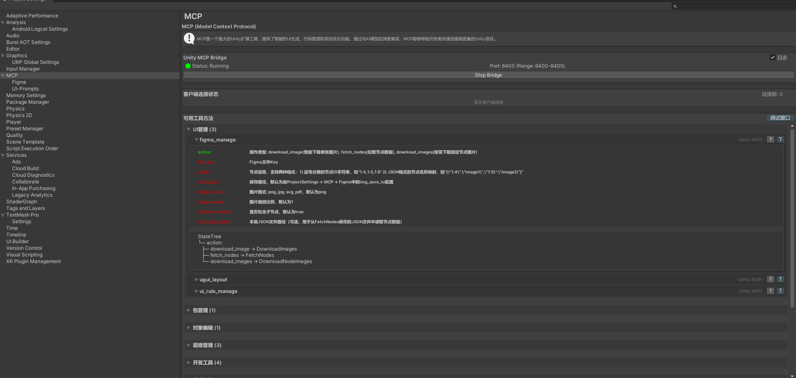

# Unity3d MCP 用户使用指南


---

## 📖 目录

1. [项目概述](#项目概述)
2. [快速开始](#快速开始)
3. [环境配置](#环境配置)
4. [核心功能](#核心功能)
5. [工具使用指南](#工具使用指南)
6. [实际应用案例](#实际应用案例)
7. [故障排除](#故障排除)
8. [常见问题](#常见问题)

---

## 🎯 项目概述

### 什么是 Unity3d MCP？

Unity3d MCP (Model Context Protocol) 是一个革命性的AI-Unity集成系统，它通过内置的MCP服务器将AI助手（如Cursor、Claude、Trae）与Unity编辑器无缝连接，实现AI驱动的Unity开发工作流。

### 🌟 核心价值

- **🤖 AI驱动开发**：通过自然语言指令控制Unity编辑器
- **🔗 无缝集成**：支持主流AI客户端，无需修改现有工作流
- **🛠️ 功能丰富**：提供40+专业工具，覆盖Unity开发全流程
- **⚡ 高性能**：基于HTTP的高效通信机制
- **🔧 可扩展**：模块化设计，易于添加新功能
- **⚙️ 零配置**：Unity内置MCP服务器，无需外部依赖

### 📊 系统架构

```
AI客户端 (Cursor/Claude/Trae)
        ↓
MCP协议层 (JSON-RPC 2.0)
        ↓
HTTP通信层 (端口8000)
        ↓
Unity内置MCP服务器
        ↓
工具执行层 (40+工具)
        ↓
Unity编辑器API
```

---

## 🚀 快速开始

### 系统要求

- **Unity版本**：2020.3+ (推荐 2022.3.61f1c1)
- **操作系统**：Windows/macOS/Linux
- **AI客户端**：Cursor、Claude Desktop、或其他支持MCP的客户端
- **网络**：本地网络连接（默认端口8000）

### 5分钟快速体验

#### 步骤1：导入Unity Package
1. 打开Unity项目
2. 将 `unity-package` 文件夹导入到项目中
3. Unity会自动编译并启动MCP服务器

#### 步骤2：配置AI客户端
在您的AI客户端配置文件中添加：

**Cursor配置** (`~/.cursor/mcp.json`)：
```json
{
  "mcpServers": {
    "unity3d-mcp": {
      "url": "http://localhost:8000"
    }
  }
}
```

**Claude Desktop配置** (`~/AppData/Roaming/Claude/claude_desktop_config.json`)：
```json
{
  "mcpServers": {
    "unity3d-mcp": {
      "url": "http://localhost:8000"
    }
  }
}
```

#### 步骤3：验证连接
在AI客户端中输入：
```
请帮我创建一个名为"TestCube"的立方体对象
```

如果看到Unity场景中出现了立方体，恭喜您已经成功配置！

---

## ⚙️ 环境配置

### Unity编辑器配置

#### MCP设置窗口
通过 `Edit → Project Settings → MCP` 打开设置窗口：



**主要配置项：**
- **🔌 连接开关**：启用/禁用MCP服务器
- **🔧 端口配置**：自定义HTTP监听端口（默认8000）
- **📝 日志级别**：设置调试日志详细程度
- **🛠️ 工具管理**：查看和管理已注册的工具
- **🎨 UI设置**：配置UI框架类型和构建流程

#### MCP调试窗口
通过 `Window → MCP → Debug Window` 打开调试窗口：


**调试功能：**
- **📊 实时监控**：查看所有MCP调用历史
- **🔍 执行追踪**：显示每次调用的详细信息
- **⏱️ 性能分析**：记录执行时间和成功率
- **🔄 重新执行**：点击历史记录重新执行命令
- **📤 导出日志**：导出调用记录用于分析

### 端口配置

#### 默认端口
- **默认端口**：8000
- **可配置范围**：1024-65535
- **推荐端口**：8000-8010（避免与其他服务冲突）

#### 端口冲突解决
如果端口8000被占用，可以：
1. 在MCP设置中修改端口号
2. 重启Unity编辑器
3. 更新AI客户端配置中的端口号

---

## 🛠️ 核心功能

### 双层调用架构

Unity3d MCP采用独特的双层调用架构：

```
AI指令 → FacadeTools → MethodTools → Unity API
```

#### FacadeTools（门面工具）
- **async_call**：异步单次调用
- **batch_call**：批量调用

#### MethodTools（功能工具）
40+专业工具，按功能分类：

| 分类 | 工具数量 | 主要功能 |
|------|----------|----------|
| 🏗️ 层级管理 | 3个 | GameObject创建、搜索、预制体应用 |
| 📝 资源编辑 | 15个 | 组件、材质、纹理、模型等编辑 |
| 📁 项目管理 | 3个 | 资源搜索、操作、创建 |
| 🎨 UI开发 | 4个 | UGUI布局、Figma集成、UI规则 |
| 🖥️ 控制台 | 2个 | 日志读写、调试输出 |
| ⚡ 代码执行 | 2个 | C#代码运行、Python脚本执行 |
| 🎮 游戏控制 | 3个 | 游戏窗口、场景视图、游戏玩法 |
| 🌐 网络工具 | 1个 | HTTP请求处理 |
| 💾 存储管理 | 2个 | 偏好设置、资源定位 |
| 📦 包管理 | 1个 | Unity包管理器操作 |

### 消息队列系统

#### 主线程安全执行
```csharp
// 自动将AI指令排队到Unity主线程执行
EnqueueTask(() => {
    // Unity API调用
    GameObject.CreatePrimitive(PrimitiveType.Cube);
});
```

#### 智能资源管理
- 自动注册/注销EditorApplication.update回调
- 防止内存泄漏和资源浪费
- 支持Unity编辑器失去焦点时继续处理请求

---

## 📚 工具使用指南

### 基础工具使用

#### 1. 创建GameObject

**自然语言指令：**
```
创建一个名为"Player"的立方体，位置在(0, 1, 0)
```

**对应的MCP调用：**
```json
{
  "func": "async_call",
  "args": {
    "func": "hierarchy_create",
    "args": {
      "name": "Player",
      "source": "primitive",
      "primitive_type": "Cube",
      "position": [0, 1, 0]
    }
  }
}
```

#### 2. 编辑组件属性

**自然语言指令：**
```
将Player对象的Transform组件的缩放设置为(2, 2, 2)
```

**对应的MCP调用：**
```json
{
  "func": "async_call",
  "args": {
    "func": "edit_component",
    "args": {
      "path": "Player",
      "component_type": "Transform",
      "action": "set_component_propertys",
      "properties": {
        "scale": [2, 2, 2]
      }
    }
  }
}
```

#### 3. 批量操作

**自然语言指令：**
```
创建5个敌人对象，分别命名为Enemy1到Enemy5，位置沿X轴排列
```

**对应的MCP调用：**
```json
{
  "func": "batch_call",
  "args": [
    {"func": "hierarchy_create", "args": {"name": "Enemy1", "source": "primitive", "primitive_type": "Capsule", "position": [0, 0, 0]}},
    {"func": "hierarchy_create", "args": {"name": "Enemy2", "source": "primitive", "primitive_type": "Capsule", "position": [2, 0, 0]}},
    {"func": "hierarchy_create", "args": {"name": "Enemy3", "source": "primitive", "primitive_type": "Capsule", "position": [4, 0, 0]}},
    {"func": "hierarchy_create", "args": {"name": "Enemy4", "source": "primitive", "primitive_type": "Capsule", "position": [6, 0, 0]}},
    {"func": "hierarchy_create", "args": {"name": "Enemy5", "source": "primitive", "primitive_type": "Capsule", "position": [8, 0, 0]}}
  ]
}
```

### 高级工具使用

#### 1. 代码执行工具

**执行C#代码：**
```
帮我运行一段C#代码，创建10个随机位置的立方体
```

**Python脚本执行：**
```
运行Python脚本下载一张图片并保存到Assets/Textures/文件夹
```

#### 2. HTTP请求工具

**下载网络资源：**
```
从https://picsum.photos/512/512下载一张随机图片到项目中
```

#### 3. 场景截图工具

**截取场景视图：**
```
帮我截取当前场景视图的截图，保存为scene_capture.png
```

**截取游戏视图：**
```
截取游戏窗口的截图，保存到Assets/Screenshots/文件夹
```

---

## 💡 实际应用案例

### 案例1：快速原型开发

**场景描述：**需要快速创建一个简单的塔防游戏原型

**AI指令序列：**
```
1. 创建一个地面平面，缩放为(10, 1, 10)
2. 创建5个敌人路径点，沿Z轴排列
3. 创建3个塔的位置，分别在(-2, 0, 2), (0, 0, 4), (2, 0, 6)
4. 为每个塔添加一个红色材质的立方体
5. 创建一个UI Canvas，添加分数显示文本
```

**执行结果：**
- 自动生成完整的塔防游戏场景布局
- 所有对象正确命名和定位
- UI元素自动配置

### 案例2：批量资源处理

**场景描述：**需要批量处理100张纹理图片

**AI指令：**
```
将Assets/RawTextures/文件夹中的所有PNG图片转换为Sprite类型，
设置Pixels Per Unit为100，Filter Mode为Point
```

**自动化流程：**
1. 扫描指定文件夹
2. 批量修改导入设置
3. 应用Sprite配置
4. 刷新资源数据库

### 案例3：性能优化分析

**场景描述：**分析当前场景的性能瓶颈

**AI指令：**
```
分析当前场景的性能问题，检查Draw Call、多边形数量、材质球数量，
并给出优化建议
```

**分析报告：**
```
=== 场景性能分析报告 ===

总GameObject数量: 156
Renderer数量: 89
不同材质数量: 23
高多边形模型: 3个
实时光源数量: 8个

=== 优化建议 ===
• 合并相似材质以减少Draw Call
• 对高多边形模型启用LOD系统
• 将静态光源改为Baked模式
• 使用对象池管理动态对象
```

### 案例4：自动化测试数据生成

**场景描述：**为RPG游戏生成测试用的角色数据

**AI指令：**
```
生成100个随机的角色配置数据，包括姓名、等级、属性、技能等，
保存为JSON格式到Assets/Data/Characters.json
```

**生成结果：**
```json
[
  {
    "id": "char_0001",
    "name": "张三",
    "level": 45,
    "health": 2500,
    "attack": 180,
    "defense": 120,
    "skills": ["火球术", "治疗", "护盾"],
    "equipment": {
      "weapon": "铁剑",
      "armor": "皮甲"
    }
  }
  // ... 99 more characters
]
```

---

## 🔧 故障排除

### 常见连接问题

#### 问题1：无法连接到Unity MCP服务器

**症状：**
- AI客户端显示连接失败
- Unity控制台没有MCP相关日志

**解决步骤：**
1. **检查Unity编辑器状态**
   ```
   确认Unity编辑器已启动并加载了项目
   ```

2. **验证MCP服务状态**
   - 打开 `Window → MCP → Debug Window`
   - 查看服务器状态是否为"Running"

3. **检查端口占用**
   ```bash
   # Windows
   netstat -an | findstr :8000
   
   # macOS/Linux  
   lsof -i :8000
   ```

4. **防火墙设置**
   - 确保端口8000未被防火墙阻止
   - 添加Unity编辑器到防火墙白名单

#### 问题2：连接频繁断开

**可能原因：**
- Unity编辑器性能问题
- 网络不稳定
- 内存不足

**解决方案：**
1. **优化Unity性能**
   - 关闭不必要的窗口
   - 减少场景复杂度
   - 清理控制台日志

2. **调整超时设置**
   - 在MCP设置中增加超时时间
   - 减少批量操作的数量

### 工具执行问题

#### 问题3：工具调用返回错误

**常见错误类型：**

1. **参数格式错误**
   ```json
   {
     "error": "Invalid parameter format",
     "details": "Expected array for 'position', got string"
   }
   ```
   **解决：**检查参数类型是否正确

2. **目标对象不存在**
   ```json
   {
     "error": "GameObject not found",
     "details": "No GameObject found at path 'NonExistentObject'"
   }
   ```
   **解决：**确认对象路径正确

3. **权限不足**
   ```json
   {
     "error": "Operation not permitted",
     "details": "Cannot modify read-only asset"
   }
   ```
   **解决：**检查文件权限或资源状态

#### 问题4：批量操作部分失败

**分析步骤：**
1. 查看MCP调试窗口的详细日志
2. 识别失败的具体操作
3. 检查操作之间的依赖关系
4. 调整操作顺序或分批执行

### 性能优化

#### 问题5：响应速度慢

**优化策略：**

1. **减少单次操作复杂度**
   ```
   将复杂操作拆分为多个简单步骤
   ```

2. **使用批量操作**
   ```
   优先使用batch_call而不是多次async_call
   ```

3. **优化Unity编辑器**
   - 关闭实时预览
   - 减少Inspector窗口数量
   - 清理项目临时文件

---

## ❓ 常见问题

### Q1：支持哪些Unity版本？
**A：**支持Unity 2020.3及以上版本，推荐使用Unity 2022.3 LTS。

### Q2：可以在运行时使用MCP工具吗？
**A：**MCP工具主要设计用于编辑器模式，运行时功能有限。建议在编辑器中完成资源配置。

### Q3：如何添加自定义工具？
**A：**
1. 在`unity-package/Editor/Tools/`创建新的C#脚本
2. 继承`StateMethodBase`或实现`IToolMethod`接口
3. 使用`[ToolName]`属性标记工具名称
4. Unity会自动发现并注册新工具

### Q4：支持多人协作吗？
**A：**每个Unity编辑器实例运行独立的MCP服务器，支持多人同时使用不同的端口。

### Q5：如何备份MCP配置？
**A：**MCP配置保存在Unity项目的`ProjectSettings`中，随项目一起版本控制。

### Q6：工具执行失败如何调试？
**A：**
1. 打开MCP调试窗口查看详细日志
2. 检查Unity控制台的错误信息
3. 验证参数格式和目标对象状态
4. 使用简化的参数重试操作

### Q7：可以离线使用吗？
**A：**MCP服务器在本地运行，不需要互联网连接。但某些功能（如HTTP请求、Figma集成）需要网络。

### Q8：如何提高批量操作性能？
**A：**
1. 使用`batch_call`而不是多次`async_call`
2. 合理分批，避免单次操作过多
3. 按依赖关系排序操作
4. 在操作前暂停自动刷新

---

## 📞 技术支持

### 获取帮助

- **📖 文档**：查看完整的README.md
- **🐛 问题反馈**：通过GitHub Issues报告问题
- **💬 社区讨论**：参与开发者社区讨论
- **📧 技术支持**：联系开发团队

### 贡献代码

欢迎贡献代码和改进建议：
1. Fork项目仓库
2. 创建功能分支
3. 提交Pull Request
4. 参与代码审查

---

## 📄 版权信息

**文档版本：** v1.0  
**最后更新：** 2024年12月  
**维护团队：** Unity3d MCP Development Team  

---

*本文档基于Unity3d MCP系统编写，旨在帮助用户快速上手和高效使用该系统。如有疑问或建议，欢迎反馈。*


