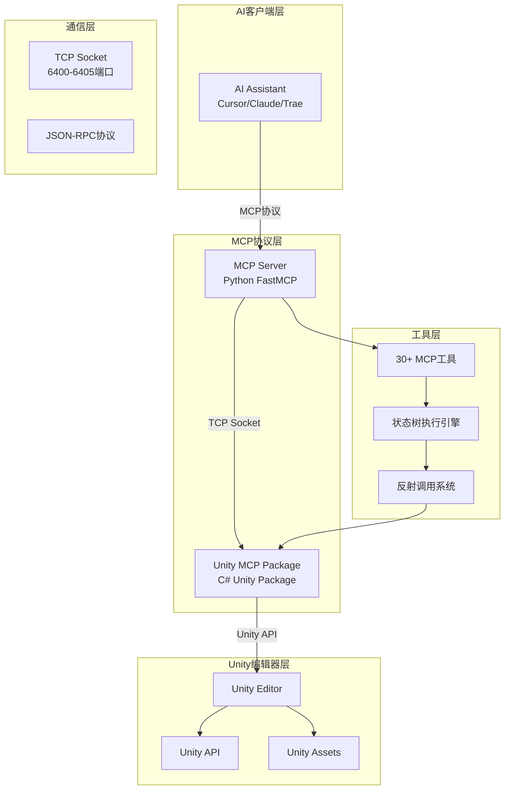
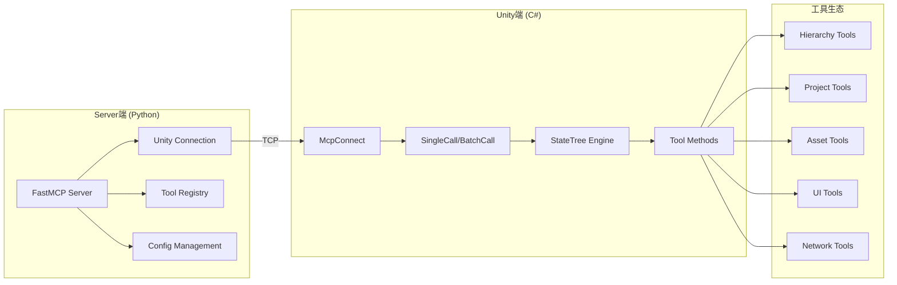
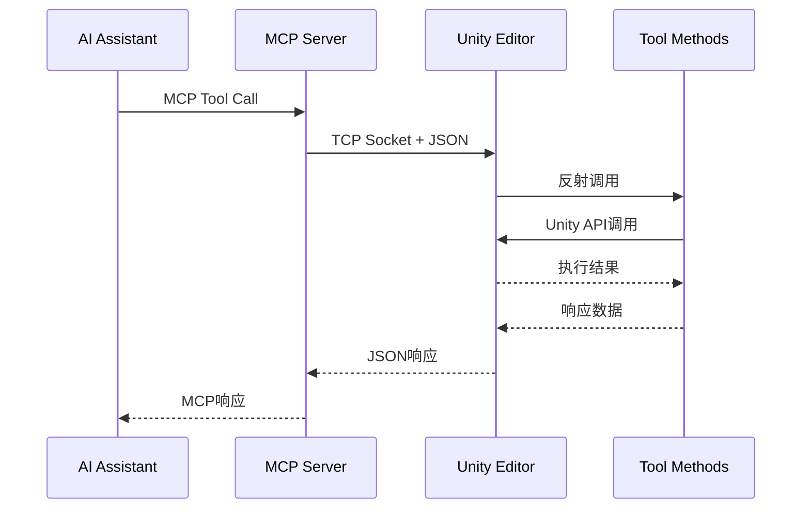
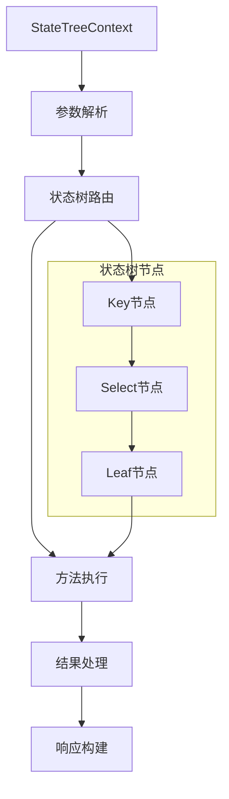

# Unity MCP 系统架构图

## 整体架构图

```mermaid
graph TB
    subgraph "AI客户端层"
        A[AI Assistant<br/>Cursor/Claude/Trae]
    end
    
    subgraph "MCP协议层"
        B[MCP Server<br/>Python FastMCP]
        C[Unity MCP Package<br/>C# Unity Package]
    end
    
    subgraph "通信层"
        D[TCP Socket<br/>6400-6405端口]
        E[JSON-RPC协议]
    end
    
    subgraph "Unity编辑器层"
        F[Unity Editor]
        G[Unity API]
        H[Unity Assets]
    end
    
    subgraph "工具层"
        I[30+ MCP工具]
        J[状态树执行引擎]
        K[反射调用系统]
    end
    
    A -->|MCP协议| B
    B -->|TCP Socket| C
    C -->|Unity API| F
    F --> G
    F --> H
    
    B --> I
    I --> J
    J --> K
    K --> C
```

## 详细组件架构

```mermaid
graph LR
    subgraph "Server端 (Python)"
        A1[FastMCP Server]
        A2[Unity Connection]
        A3[Tool Registry]
        A4[Config Management]
    end
    
    subgraph "Unity端 (C#)"
        B1[McpConnect]
        B2[SingleCall/BatchCall]
        B3[StateTree Engine]
        B4[Tool Methods]
    end
    
    subgraph "工具生态"
        C1[Hierarchy Tools]
        C2[Project Tools]
        C3[Asset Tools]
        C4[UI Tools]
        C5[Network Tools]
    end
    
    A1 --> A2
    A1 --> A3
    A1 --> A4
    A2 -->|TCP| B1
    B1 --> B2
    B2 --> B3
    B3 --> B4
    B4 --> C1
    B4 --> C2
    B4 --> C3
    B4 --> C4
    B4 --> C5
```

## 数据流架构

```mermaid
sequenceDiagram
    participant AI as AI Assistant
    participant MCP as MCP Server
    participant Unity as Unity Editor
    participant Tools as Tool Methods
    
    AI->>MCP: MCP Tool Call
    MCP->>Unity: TCP Socket + JSON
    Unity->>Tools: 反射调用
    Tools->>Unity: Unity API调用
    Unity-->>Tools: 执行结果
    Tools-->>Unity: 响应数据
    Unity-->>MCP: JSON响应
    MCP-->>AI: MCP响应
```

## 状态树执行架构

```mermaid
graph TD
    A[StateTreeContext] --> B[参数解析]
    B --> C[状态树路由]
    C --> D[方法执行]
    D --> E[结果处理]
    E --> F[响应构建]
    
    subgraph "状态树节点"
        G[Key节点]
        H[Select节点]
        I[Leaf节点]
    end
    
    C --> G
    G --> H
    H --> I
    I --> D
```